# Robust speech-command recognition under acoustic shift

Does a model's *confidence* survive acoustic shift as well as its *accuracy* does? This study trains
small keyword-spotting models on Google Speech Commands v0.02, instruments them during training, and
then measures calibration, selective risk and conformal coverage as the audio degrades.

The short answer is no, and the gap is not subtle. Under moderate additive noise the best model keeps
a plausible-looking output distribution while its accuracy collapses to near chance, and the conformal
procedure that is supposed to guarantee coverage misses its target by a factor of fifteen.

Three notebooks: the mathematics, a synthetic sandbox, and the real run.

## Key results

Best architecture (`ConvGRU`, 291,564 parameters) on the real corpus. Exploration configuration —
4 stress conditions, 200 bootstrap resamples, one seed.

| condition | accuracy | ECE (10 bins) | OOD AUROC | CRC miscoverage (target 0.05) |
|---|---|---|---|---|
| clean | 0.8787 | 0.0263 | 0.8291 | 0.0722 |
| `gain_+10` | 0.8287 | 0.0503 | 0.8046 | 0.1000 |
| `reverb_mid` | 0.8176 | 0.0482 | 0.7504 | 0.1009 |
| **`noise_10`** | **0.1380** | **0.7469** | **0.4727** | **0.7565** |

| model | params | val accuracy | final train CE | AutoClip clip rate |
|---|---|---|---|---|
| `ConvGRU` | 291,564 | **0.9008** | 0.0100 | 65.8% |
| `WideCNN` | 271,692 | 0.8790 | 0.0182 | 70.2% |
| `TimePoolCNN` | 17,212 | 0.5556 | 0.9794 | 99.1% |
| `LogMelCNN` (global-average-pooled baseline) | 14,524 | 0.3730 | — | — |

**Findings worth stating plainly.**

- **Keeping the time axis is not enough; recurrence is what helps.** `TimePoolCNN` preserves temporal
  structure and still lands inside the baseline's seed band.
- **Calibration fails before coverage does, and coverage fails badly.** Even on `clean`, unweighted
  conformal risk control misses its 0.05 target. Under `noise_10` it reaches 0.7565.
- **The published explanation does not transfer.** The CRNN literature attributes the recurrent
  advantage to noise-signature adaptation; here the recurrent model is the *worst* of the three under
  noise (0.1380 against `WideCNN`'s 0.2519).
- **A widely-used instability signal is uninformative in raw space.** Measured in the network's own
  feature space it fires identically for healthy and unhealthy runs; projected first, as its source
  specifies, it separates them.

## Figures

### Notebook 01 — the mathematics

| | |
|---|---|
| 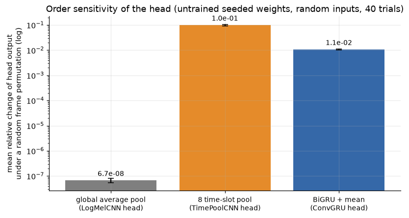 | 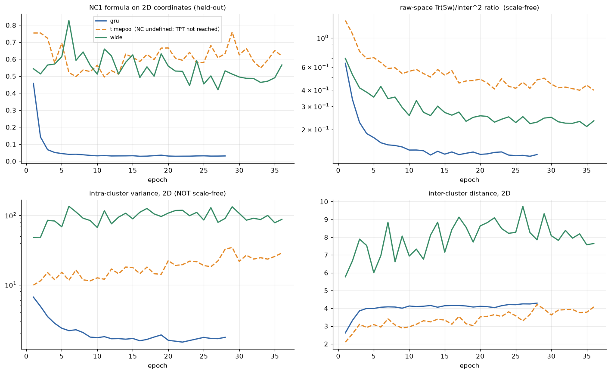 |
| **Global average pooling is order-blind.** Why a model that averages over time cannot distinguish sequences that differ only in order. | **NC1 and NC2 across training.** Within-class variability collapse and the simplex-ETF geometry, per architecture. |

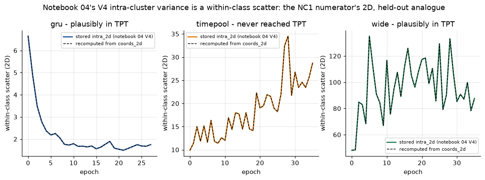

**Theory meets measurement.** The cluster-health metric logged during the real run is the 2D, held-out
analogue of the neural-collapse NC1 numerator: a within-class scatter recomputed from the stored
coordinates (dashed) lies exactly on the stored series (solid). Panel titles carry each arm's
terminal-phase status, because NC1 is only defined once training error reaches zero — which
`TimePoolCNN` never did, so the neural-collapse reading simply does not apply to it.

| | |
|---|---|
| 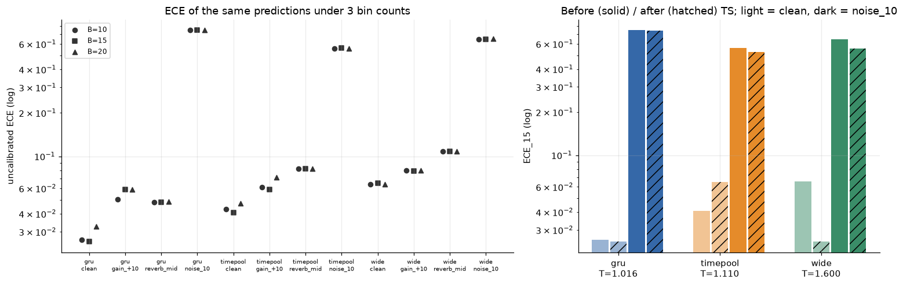 | 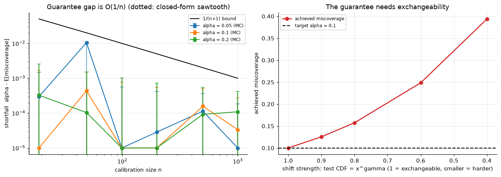 |
| **ECE is bin-count dependent.** The same predictions score differently at 10, 15 and 20 bins, which is why all three are reported. | **The conformal shortfall obeys its O(1/n) bound (left) — until exchangeability is removed (right),** where miscoverage climbs from 0.10 to 0.39. |

### Notebook 02 — the synthetic sandbox

| | |
|---|---|
| 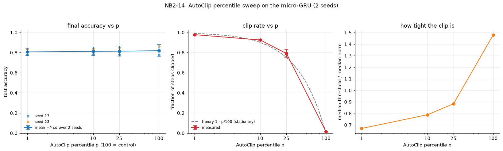 | 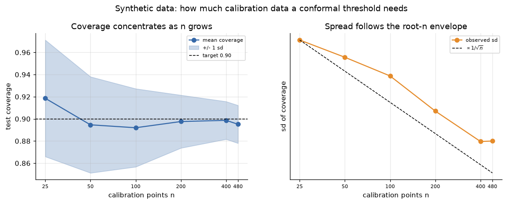 |
| **Clipping percentile sweep**, `p ∈ {1, 10, 25, 100}` with `p=100` as the unclipped control. | **How much calibration data a conformal threshold needs.** Coverage is unbiased at every n; the *spread* is what shrinks, following the root-n envelope. |

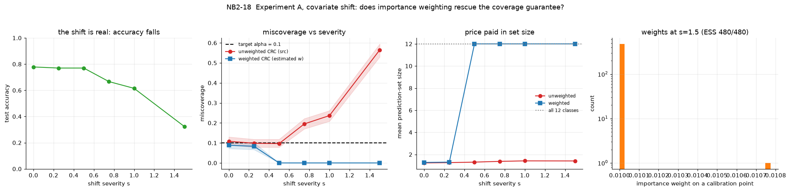

**Importance weighting restores coverage under covariate shift — by abstaining.** Unweighted
miscoverage climbs to 0.56 against a 0.1 target while the weighted estimator holds it, but the fourth
panel shows the price: prediction sets inflate to all 12 classes. The guarantee is recovered at the
cost of saying nothing.

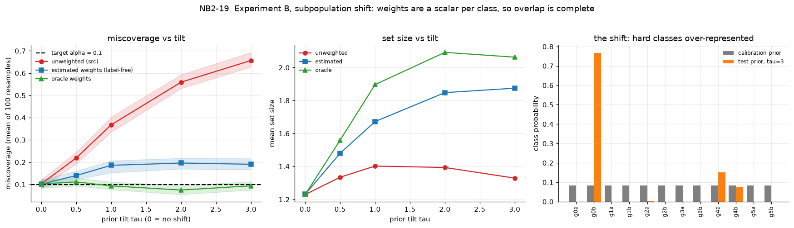

**The same experiment under label shift**, with an estimated and an oracle weighting, separating
"weighting helps" from "knowing the true weights helps".

### Notebook 04 — the real run

| | |
|---|---|
| 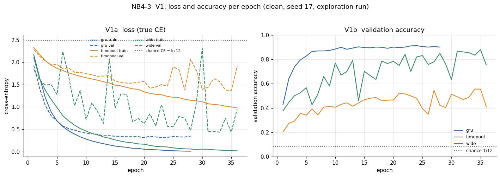 | 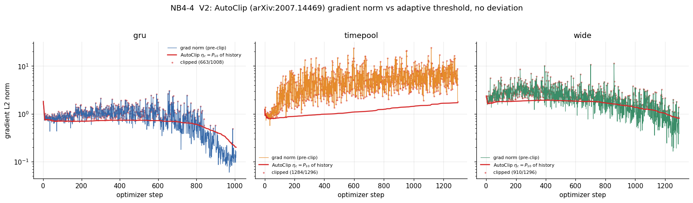 |
| **True-CE training curves.** All three start just below ln(12) = 2.4849, chance for 12 classes — an independent confirmation that the loss accounting is right. | **Gradient norms against the adaptive threshold.** The threshold tracks the gradient distribution rather than ratcheting down; the real finding is the clip *rate*. |

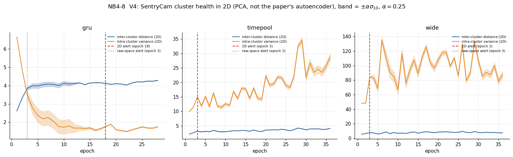

**Representation geometry per epoch**, with the rolling-σ band and the alert epochs marked. `ConvGRU`
separates and tightens; the other two do not.

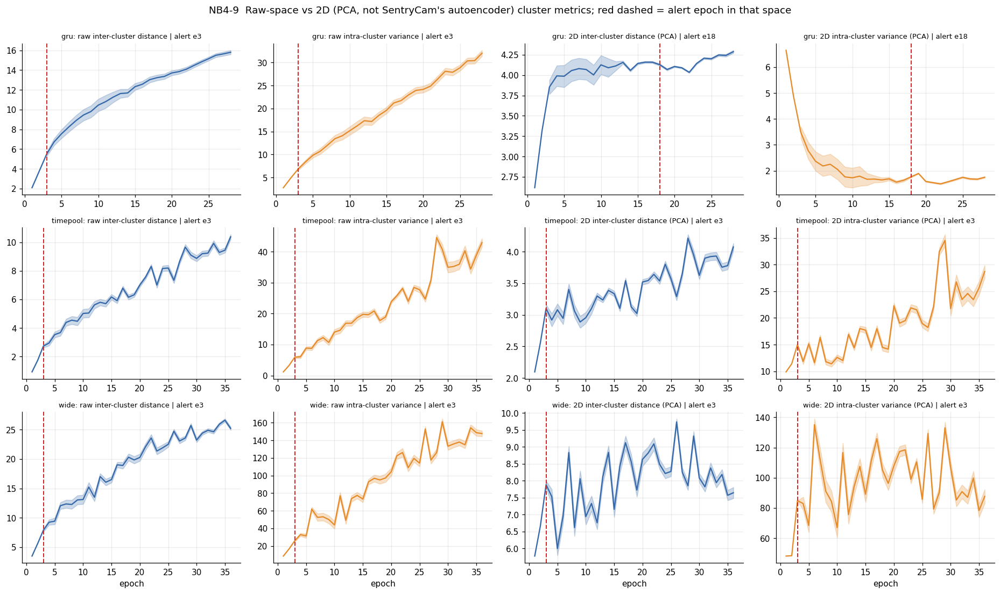

**The headline.** Drift metrics computed in raw feature space fire at the same early epoch for every
architecture and so distinguish nothing. The same metrics computed after projection — as the source
specifies — separate the healthy run from the two unhealthy ones by *when* they fire.

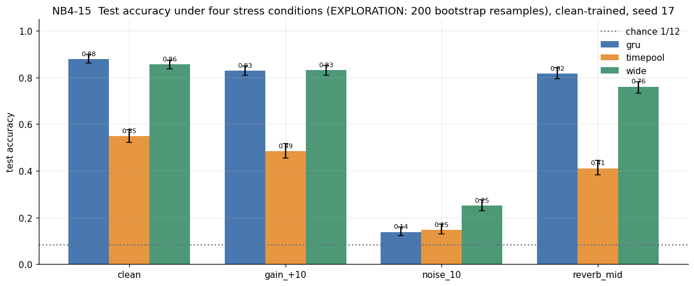

**Accuracy with bootstrap intervals** across three architectures and four conditions. The `noise_10`
column is the study's central negative result.

### Representation geometry from the GPU run

The six figures below are the remote training run's own visualisations — penultimate-layer activations
and hidden-unit tensors captured every epoch on the GPU, then projected. Both are **PCA**, which is a
labelled deviation: the drift literature specifies a parametric autoencoder and MM-PHATE specifies a
diffusion-potential embedding with MDS. The deviation is printed in every figure title so it travels
with the image.

**Penultimate-layer projection, per epoch, coloured by true class.** This is the study's clearest
picture of learning as geometry.

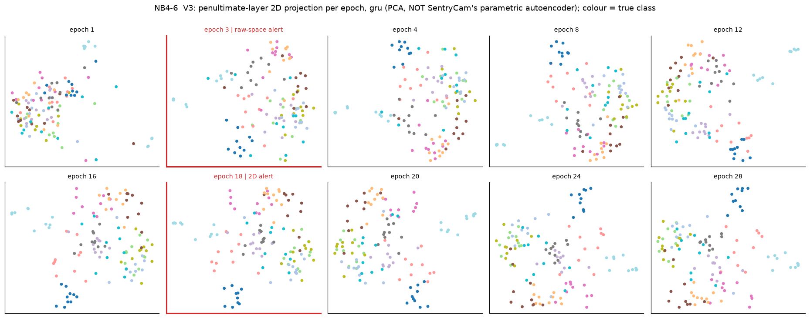

`ConvGRU` — a single blob at epoch 1 resolving into separated class groups by epoch 28. Both alert
epochs are outlined in red: the raw-space alert at epoch 3, when nothing has happened yet, and the
projected alert at epoch 18, once the geometry has actually settled.

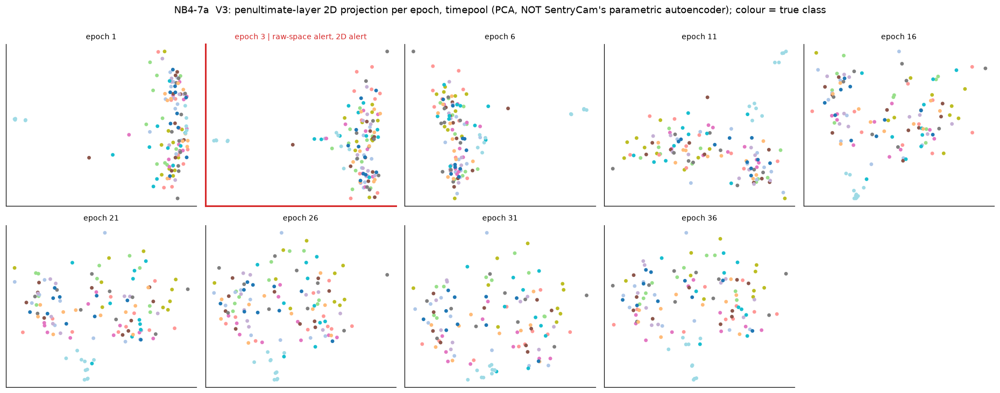

`TimePoolCNN` — the counterpoint, and the reason the study reports a negative result. Thirty-six
epochs and the classes never separate; the cloud spreads without organising. Its raw-space and
projected alerts both fire at epoch 3, which is what an alert looks like when it carries no
information.

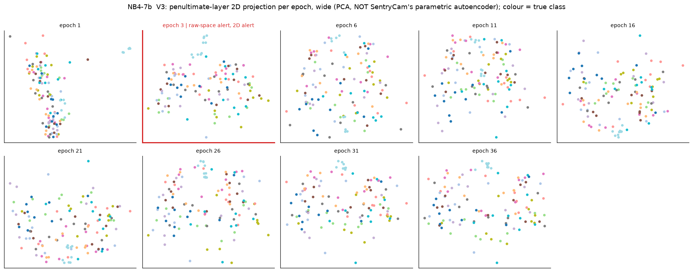

`WideCNN` — partial separation that keeps reorganising rather than settling, matching the violent
validation-loss oscillation in its training curve.

**Multiway embedding of the activation tensor.** Every node is one (epoch, sequence step, hidden unit)
triple — 17,920 of them for `ConvGRU` — coloured twice, by epoch and by sequence step.

| | |
|---|---|
| 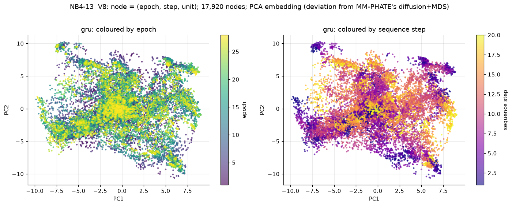 | 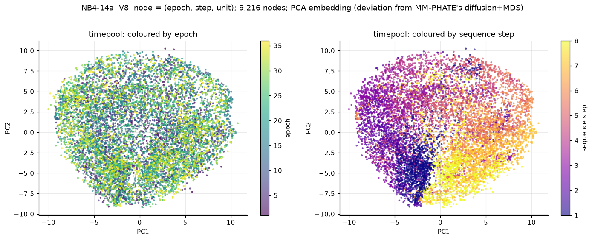 |
| `ConvGRU`: 20 sequence steps. Late epochs concentrate centrally while sequence step sweeps a clear gradient across the embedding — units specialise by position in the utterance. | `TimePoolCNN`: 8 time slots, and a far weaker step gradient. |

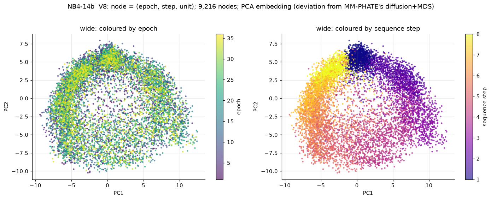

`WideCNN` — the widest spread of the three, consistent with its unstable within-class variance.

**All 32 figures from this run are in [`figures/nb4/`](figures/nb4/)** — the six above are the ones
worth putting on a front page, but the complete set is hosted here rather than left on Drive: the
V4 cluster-health curves, the V5-V7 MM-PHATE entropy and flow statistics, the per-class geometry, the
2D nearest-neighbour diagnostics, the resource tables and the full post-training calibration,
selective-risk, conformal and OOD panels. The checkpoints and the metric arrays they were drawn from
are in the Drive folder linked below.

## Papers

**Architecture** — Arık et al., *Convolutional Recurrent Neural Networks for Small-Footprint Keyword
Spotting*, [arXiv:1703.05390](https://arxiv.org/abs/1703.05390).

**Representation geometry** — Papyan, Han & Donoho, *Prevalence of Neural Collapse during the terminal
phase of deep learning training*, [arXiv:2008.08186](https://arxiv.org/abs/2008.08186).

**Calibration** — Hebbalaguppe et al., *A Stitch in Time Saves Nine: A Train-Time Regularizing Loss for
Improved Neural Network Calibration*, [arXiv:2203.13834](https://arxiv.org/abs/2203.13834).

**Optimization** — Seetharaman et al., *AutoClip: Adaptive Gradient Clipping for Source Separation
Networks*, [arXiv:2007.14469](https://arxiv.org/abs/2007.14469).

**Drift monitoring** — *SentryCam*, [arXiv:2405.15135](https://arxiv.org/abs/2405.15135), and
*MM-PHATE*, [arXiv:2406.01969](https://arxiv.org/abs/2406.01969).

**Conformal guarantees** — Angelopoulos et al., *Conformal Risk Control*,
[arXiv:2208.02814](https://arxiv.org/abs/2208.02814).

**Dataset** — Warden, *Speech Commands: A Dataset for Limited-Vocabulary Speech Recognition*,
[arXiv:1804.03209](https://arxiv.org/abs/1804.03209).

Each notebook carries a traceability table mapping every claim to its paper, section and formula, and
states the deviations where this implementation departs from the source.

## Run artifacts

The training checkpoints, the per-epoch metric arrays, the prepared dataset splits and the full set of
32 generated figures are hosted separately, since they are too large to version here:

**[deep-learning-first-project on Google Drive](https://drive.google.com/drive/folders/1_aUK1YWY_XwKDWF3iWwtrNkL_gNyF0ex?usp=sharing)**

```
checkpoints/       trained weights for every architecture
metrics/           arch-*.result.json and arch-*.probes.npz -- what the notebooks read
train-val-split/   the prepared splits, so the run is reproducible without re-downloading 2.4 GB
figures/nb4/       all 32 figures from the real run
```

## Layout and running it

```
notebooks/     three notebooks and the builder scripts that generate them
src/           the library under test: data, models, training, diagnostics, calibration, metrics
tests/         358 contract tests
figures/       the 20 figures shown in this README, plus nb4/ with all 32 from the GPU run
```

```bash
python3 -m pip install -e .
python3 -m pytest tests -q          # 358 passed
```

Notebooks are generated from `notebooks/build/` — edit the builder scripts, then regenerate:

```bash
python3 notebooks/build/build_nb1.py
jupyter nbconvert --to notebook --execute --inplace notebooks/01_research_foundations.ipynb
```

Notebook 04's cells are tagged `offloaded` where they need the run artifacts above; a local run skips
them rather than failing. See `notebooks/README.md` for what each notebook does and `src/README.md`
for the library.

## Scope and limitations

- Results are an **exploration** configuration: 4 stress conditions, 200 bootstrap resamples, one
  training seed. The 11-condition, 2000-resample evaluation was never run.
- The frozen-versus-adapted pretrained-encoder comparison was never run.
- Conformal risk control here is **unweighted**, the known failure mode under shift. It is measured
  and reported, not fixed.
- Where a method is approximated — PCA substituting for a parametric autoencoder, or for diffusion
  plus MDS — the deviation is labelled in the figure title and in the notebook's limitations section.
- Literature figures are attributed to a paper and a conversation turn. They were checked verbatim
  when written, but the raw research answers are not published here, so that check is not reproducible
  from this repository; audit them at the arXiv sources.
- Notebook 02 is synthetic by design. Notebook 04 contains no synthetic data of any kind.
